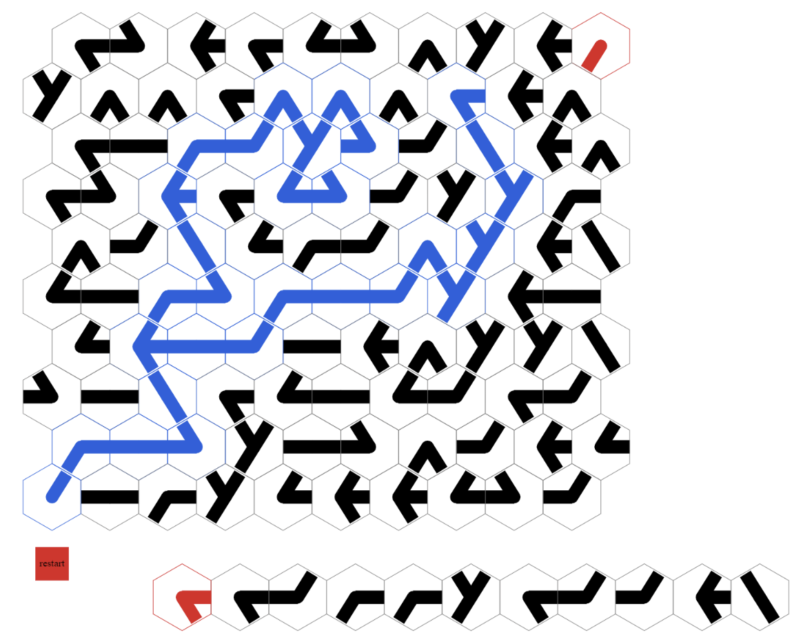

# Pipes game written using Haskell



This is simple game where you can replace pipes on the map to move water

## How to use

### Using Cabal

To build and run a project, use

```sh
cabal v2-run --disable-tests
```

from the project directory. This will download all the necessary dependencies, compile the project and start CodeWorld canvas server at http://localhost:3000

## Documentation

To get documentation, use

```sh
cabal v2-haddock
```

and open the following link in browser

```
{pwd}\pipes\dist-newstyle\build\x86_64-windows\ghc-8.10.7\haskell-codeworld-template-0.1.0\doc\html\haskell-codeworld-template\index.html
```